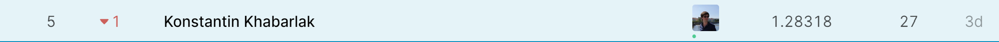
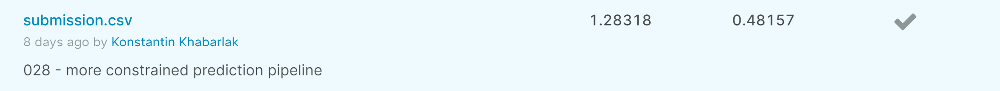

# Описание решения распознавания автомобильных номеров (private: 4-е место, public: 3-е место)

## Сегментация

Использовал модель NAS + MobileNetV2. Сеть NAS понравилась тем, что работала быстрее, потребляла меньше памяти по сравнению с комбинацией UNet + MobileNetV2, но давала хорошее качество.

Обучал 25 эпох на разрешении 460x460.

Использовал большое количество аугментаций:
* Горизонтальное отображение
* Добавление шума, изменение гаммы, контрастности, перемешивание каналов
* CoarseDropout и сжатие изображений
* Добавление дождя и солнечного света

|  #  | Train Bce | Train Dice Loss | Train Loss | Train Dice | Val Dice |
| --- | --------- | --------------- | ---------- | ---------- | -------- |
| 017 | 0.00678   | 0.08485         | 0.04581    | 0.91919    | 0.93196  |

## Распознавание

1. ResNet34
2. Двунаправленный GRU с размером скрытого состояния 512, Dropout 0.3

Перекочевало большинство аугментаций, но с меньшей силой

|  #  | Train Loss | Train Acc | Train EditDist | Val Acc  | Val EditDist |
| --- | ---------- | --------- | -------------- | -------- | ------------ |
| 015 | 0.12789    | 0.82573   | 0.34443        | 0.95523  | 0.06230      |

## Генерация предсказаний

### Проблема очень разных изображений в выборке

Были и повернутые, и большие, и скошенные.

Для решения в test-time делал несколько предсказаний:
1. Оригинальное изображение
2. С поворотом &plusmn;30
3. Уменьшение в 2 раза
4. Перестановка каналов
5. Также по маске сегментации искал четырёхугольник, выровнять и на нём делать предсказание

Среди них выбирал лучшее.

### Проблема ложных срабатываний модели

Описанная модель имела много ложных срабатываний на:
1. Наклейках на автомобилях
2. Двойных номерах
3. Частично видных номерах

Чтобы отсеивать такие случаи было сделано два порога:

Первый: средняя уверенность модели по предсказаниям 8-ми знаков (уверенность предсказания разделителя не учитывалась). Выставлен в 0.8. Это позволило отсеить 1, 2, но не 3.

Второй: среди первого набора выберем 2 наименее "уверенных" символа и скажем, что их значение должно быть больше 0.7 - побороло 3.

## Доска

## Отправка

